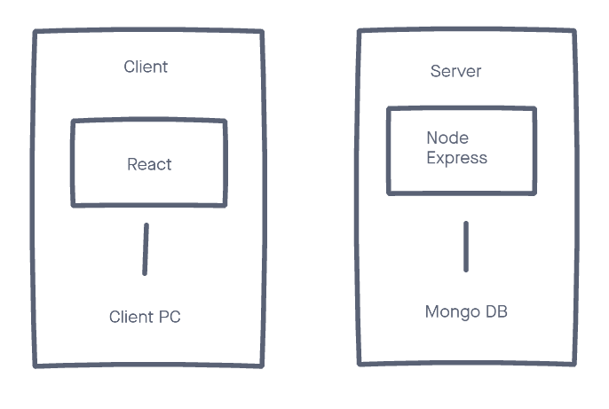

# Coder Academy - Workbook
## Assignment 1 - Term 3 (T3A1)


## Question 1
### Provide an overview and description of a standard source control process for a large project

*Provides an extensive overview and description of a standard source control process*

References:

---
## Question 2
### What are the most important aspects of quality software?

There are six important qualities when softwares is built. They are reliability, functionality, usability, maintainability, portability and efficiency. I will outline them in detail below. These qualities are defined in ISO/IEC 9126-1:2001. It is an international standard for software quality set by ISO. ISO/IEC 9126-1:2001 is now replaced by ISO/IEC 25010:2011 and withdrawn. 
Developers must know which qualities are more important when creating softwares because some qualities are more important than the other depending on what softwares. In order to avoid spending too much time on the less important qualities and streamline your work, it is important to discern which qualities are prioritised over the others. 

- **Reliability** - This refers to the degree to which the function continues to operate normally, and to which failure is unlikely to occur. Secondary characteristics include maturity, disability tolerance, and resilience. The following items can be listed as indicators for measuring the reliability of software. 
  - Mean Time Between Failure(MTBF) - It is the average time from one failure to the next. In other words, it's a number that tells you how long a software can run normally, so the higher this number, the more reliable the software.
  - Mean Time To Repair(MTTR) - The average time from a software failure to the completion of repair. Therefore, the smaller this number is, the faster the software can recover from the failure.
  - Uptime calculation - the formula is uptime = MTBF/(MTBF + MTTR). It is the ratio that the software was actually running, calculated from the above two numbers.
- **Functionality** - This refers to the degree of implementation of necessary functions required by purpose. Secondary characteristics include purposefulness, accuracy, interoperability, standard relevance, and security. 
- **Usability** - This refers to the degree of easy to understand and use of the software. Sub-characteristics include comprehension, learning, and operability.
- **Maintainability** -  This refers to the degree of effort required for maintenance and revision work of the softwares. Secondary characteristics include analyzability, changeability, stability, and testability.
- **Portability** - This refers to the ease of porting, degree of operation as it is when moving to another environment. Secondary characteristics include environmental applicability, installability, standard conformance, and replaceability.
- **Efficiency** - This refers to the degree of time and resources used to achieve goals. Secondary characteristics include time efficiency and resource efficiency.

References:
https://www.silasreinagel.com/blog/2016/11/15/the-seven-aspects-of-software-quality/
https://www.iso.org/standard/22749.html
https://www.opservices.com/mttr-and-mtbf/

---
## Question 3
### Outline a standard high level structure for a MERN stack application and explain the components

MERN is an acronym of MongoDB, Express, React and Node.js. MERN stack is used for efficiently developing full-stack web applications by using JavaScript. The MERN architecture makes it easy to build a three-tier architecture with full Javascript and JSON, including the front-end display layer (React), application layer (Express and Node), and database layer (MongoDB).

- **MongoDB** - this is a Document-oriented No-SQL database used to create, read, update and delete data.
- **Express** - this is Node.js framework. For example, it's a hassle to process individual requests from users with different URL paths from scratch in Node.js, but Express makes it easy.
- **React** - this is a Javascript library to build a UI component that creates the UI for a single-page web app. It is responsible for only V of the MVC model, and quick rendering can be expected by implementing a virtual DOM.
- **Node.js** - this is a Javascript runtime built on Chrome's V8 Javascript engine. 

The picture below illustrates how MERN stack works. React is responsible for the View, which means the part that the user can see. Express provides a method that specifies which function is called and which template engine is used for a particular HTTP request (GET, POST, DELETE, etc.. ) and that URL pattern does.

For example, if I want to send some data and click the send button:

Click the submit button

→ React executes function related to transmission

→ Express executes the process for that function. Send the process I want MongoDB to execute

→ MongoDB executes the process that came from Express

→ Complete



References:

https://www.geeksforgeeks.org/mern-stack/
https://qiita.com/Kage_/items/ffb0c213bfc36eae3592


---
## Question 4
### A team is about to engage in a project, developing a website for a small business. What knowledge and skills would they need in order to develop the project?

*Effectively describes a range of skills and knowledge required by IT workers to complete a quality web development project*

References:

-----------
## Question 5
### With reference to one of your own projects, discuss what knowledge or skills were required to complete your project, and to overcome challenges

*Effectively describes a range of skills and knowledge used to complete a project.*

References:

---------------
## Question 6
### With reference to one of your own projects, evaluate how effective your knowledge and skills were for this project, and suggest changes or improvements for future projects of a similar nature

*Evaluates effectiveness of knowledge and skills accurately, providing examples, and providing an insightful improvement on each skill*

References:

-----------
## Question 7
### Explain control flow, using an examples from the JavaScript programming language

`if` executes the statement if the specified condition is true.
```javascript 
let a = 0;
if(a === 0){
  console.log('a is zero');
}
// You can use else to specify the statement to be executed when the conditional part of if is false.

let a = 1;
if(a === 0){
  console.log('a is zero');
}else{
  console.log('a is not zero');
}

// It is possible to specify multiple condition parts with else if.
let a = 1;
if(a === 0){
  console.log('a is zero');
}else if(a === 1){
  console.log('a is one');
}else{
  console.log('a is not zero , one');
}
```

If I want to branch the process into multiple parts depending on the value of the expression, I can use the switch statement. `default` is executed when there is no matching target in the case clause. If I connect `case` without breaking, I can perform the same processing with multiple branches.

```javascript 
const str = 'two';
switch (str) {
  case 'one':
    console.log('string is one');
    break;
  case 'two':
  case 'three':
    console.log('string is two or three');
    break;
  default:
    console.log('string is not one , two ,three');
}
```

Exception handling can be done with the `try-catch-finaly` statement.
When an exception occurs in `try`, the `catch` statement is called, and finally the `finally` statement is called. It is possible to specify only one of `catch` and `finaly`. If there is something I want to do, even though it does not handle the exception, I should use it in the form of `try-finally`.

```javascript 
try {
  let a = null;
  a.toString();
  let b = c;
} catch (e) {
  if (e instanceof TypeError) {
    console.log(`TypeError Catch! ${e}`);
  } else if (e instanceof ReferenceError ) {
    console.log(`ReferenceError Catch! ${e}`);
  } else {
    console.log(e);
  }
} finally {
    console.log('finally');  
}
```
References:
https://javascript-reference.org/grammer/control-flow/
https://www.javascriptinstitute.org/javascript-tutorial/control-structures/

---
## Question 8
### Explain type coercion, using examples from the JavaScript programming language

Type coercion refers to converting one data type to another. There are three types of conversion in JavaScript, which are to string, to boolean and to numbers. 

- **String conversion**　- `toString` or `string()` is used when converting to a string explicitly. Implicit coercion occurs by the binary + operator, when any operand is a string:

```javascript
String(678)    // explicit
678.toString() // explicit
789 + ""       // implicit
```

All primitive values are converted to strings automatically like below:

```javascript
String(890)                   // '890'
String(-35.3)                 // '-35.3'
String(null)                  // 'null'
String(undefined)             // 'undefined'
String(true)                  // 'true'
String(false)                 // 'false'
```

- **Boolean conversion** - A value is converted to a logical value when the value is described, for example, in a conditional expression of an if statement or logical operators ( || && !).

```javascript
Boolean(100)          // explicit
if (100) { ... }      // implicit due to logical context
!!100                 // implicit due to logical operator
100 || 'hello'        // implicit due to logical operator
```
Falthy values such as `""`, 0, -0, `Nan`, `null`, `undefined` and `false` automatically returns false. Truthy values including object, function, `Array`, `Data` and symbols returns true naturally. 

- **Numeric conversion** - `Number()` function can be used for explicit conversion just like Boolean() and String() mentioned above. Implicit conversion is triggered in cases like comparison operators `>, <, <=,>=`, 
bitwise operators ` | & ^ ~`, arithmetic operators `- + * / % `, unary `+` operator and loose equality operator `== (incl. !=)`. binary`+` does not work as numeric conversion, when any operand is a string.  `==` does not work as numeric conversion when both operands are strings.

```javascript
Number("1200")  // explicit
+'56y'          // implicit
456 != '678'    // implicit
6 > '7'         // implicit
6/null          // implicit
true | 0        // implicit
```
Primitive values are converted to numbers like below:
```javascript
Number(null)                   // 0
Number(undefined)              // NaN
Number(true)                   // 1
Number(false)                  // 0
Number(" 34 ")                 // 34
Number("-45.34")               // -45.34
Number("\n")                   // 0
Number(" 35s ")                // NaN
Number(456)                    // 123
```

------------------
## Question 9
### Explain data types, using examples from the JavaScript programming language

There are 8 types of data types in JavaScript. They are boolean, number, string, undefined, null, symbol, bigint and object. They are all primitive values except for objects. It is possible for Primitive to check data types by using `typeof` like an example below. 

```javascript
console.log(typeof true);// => "boolean"
```
Primitive values are immutable, which means values types are not changed in contexts. Objects categorised as objects, which means they are collections of properties. I will outline these data types in detail below. 
- **Boolean** - it is a logical data type that can only have true and false in its value. It is often used in `if` sentences like below. 

```javascript
if (boolean conditional) {
   // code to execute if the conditional is true
}

if (boolean conditional) {
  console.log("boolean conditional resolved to true");
} else {
  console.log("boolean conditional resolved to false");
}
```
Boolean also returns true or false as a result of inputs like below. 


```javascript 
let a = "1";
let b = 1;

console.log(a === b); // returns false as a result
console.log(a == b); // returns true as a result
```

- **Number** - Number means natural numbers. There are three types of symbolic values, which are +Infinity, -Infinity, and NaN ("Not a Number"). The examples are below. 

```javascript
42 / +0
Infinity
42 / -0
-Infinity
```

- **Bigint** - this is also number but is only used for big numbers with arbitrary precision. `n` is added after numbers like an example below. One thing to be reminded is that it can not be used in "Safari" browser. 
```javascript
const x = 2n ** 53n;
9007199254740992n
const y = x + 1n;
9007199254740993n
```

- **String** - it is used to represent textual data like below. Each element in the string has a position, the first element starts with 0, the next one is 1 and so on. The length of the string starts counting with 1.  

```javascript
let fruits = ["banana", "apple", "mandarin"]
// banana is [0] and apple is [1]

console.log(fruits[2]) // returns "mandarin" as a result
console.log(fruits.length) // returns 3 as a result
```

- **Symbol** - Symbols can only be created with the Symbol function. The substance of the symbol is "something unique", like a unique key that never conflicts, but not string data. Therefore, even if you try to see the contents in console.log, you cannot express the characters, so the output will be as follows.

```javascript
// Here are two symbols with the same description:
let Sym1 = Symbol("Sym")
let Sym2 = Symbol("Sym")

console.log(Sym1 === Sym2) // returns "false"
// Symbols are guaranteed to be unique.
// Even if we create many symbols with the same description,
// they are different values.

```
- **Undefined** - `undefined` is one of the properties of the global object, which means it is a variable in global scope. The initial value of undefined is the primitive value undefined.

- **Null** - A null literal is a literal that returns a null value. `null` is a value that means "no value". If you refer to an undefined variable, you will get a `ReferenceError` because it cannot be referenced, as shown below.
```javascript
foo;// "ReferenceError: foo is not defined"
```

If you want to express that foo has no value, you can define a variable called foo with a null value by assigning a null value. This allows you to define and reference foo as a variable with no value.
```javascript
const foo = null;
console.log(foo); // => null
```
- **Object** - Object literals can create new objects by writing {} (curly braces).
```javascript
const obj = {}; // created an empty object
```
Object literals can define their contents as soon as the object is created. You can create and initialize the object at the same time by writing the key and value of the object separated by: in {}.

The object created by the following code creates an object with a key name of key and a value of value. The key name can be a string or Symbol, and the value can be anything from a primitive type value to an object.

```javascript
const obj = {
    "key": "value"
};
```
References:
https://developer.mozilla.org/en-US/docs/Web/JavaScript/Data_structures


---
## Question 10
### Explain how arrays can be manipulated in JavaScript, using examples from the JavaScript programming language

There are many ways to manipulate arrays in JavaScript. Arrays can be manipulated by using these methods below. For example, they allow you to add an item in an array. 

- **toString()** - this changes an array to a string separated by a comma.
- **join()** - this put all array elements together into a string just like toString(). However, the difference is that you can specify a space or-between () and add it between items.

```javascript
// an exmaple of toString(), join()
let colors = ['pink', 'yellow', 'purple'];

console.log(colors.toString()); //returns pink,yellow,purple 
console.log(colors.join('-')); // green-yellow-blue
```

- **concat** - this combines two arrays together or add more items to an array and then return a new array.

```javascript
// an example of concat
let firstNumbers = [10, 11, 12];
let secondNumbers = [13, 14, 15];
let combined = firstNumbers.concat(secondNumbers);
console.log(conbined); // [10, 11, 12, 13, 14, 15]
```

- **push()** - this adds item(s) to the end of an array and changes the original array.

```javascript
let fish = ["salmon", "king fish", "snapper"];
fish.push("tuna", "barramundi");
console.log(fish); 
// [ 'salmon', 'king fish', 'snapper', 'tuna', 'barramundi' ]
```
- **pop()** - this removes the last item of an array and returns it

```javascript
let fish = ["salmon", "king fish", "snapper"];
fish.pop();
console.log(fish);
// ["salmon", "king fish"]
```
- **shift()** - This is the exact opposite of `pop()` above. It removes the first item of an array and returns it.

```javascript
let fish = ["salmon", "king fish", "snapper"];
fish.shift();
console.log(fish);
// ["king fish", "snapper"]
```
- **unshift()** - This is the exact opposite of `push()`. It adds an item(s) to the beginning of an array and changes the original array.

```javascript
let fish = ["salmon", "king fish", "snapper"];
fish.unshift("tuna", "barramundi");
console.log(fish);
// ["tuna", "barramundi", "king fish", "snapper"]
```

- **splice()** -this method allows you yo change an array, by adding, removing and inserting elements. 
The array can be cut from the index specified first by the length specified second.

```javascript
let fish = ["salmon", "king fish", "snapper", "tuna", "barramundi"];
fish.splice(0, 1)
console.log(fish);
// [ 'king fish', 'snapper', 'tuna', 'barramundi' ]
fish.splice(0, 2)
console.log(fish);
// [ 'snapper', 'tuna', 'barramundi' ]
```
Below the third argument is the value to be assigned to the clipped value.

```javascript
let fish = ["salmon", "king fish", "snapper", "tuna", "barramundi"];
fish.splice(0, 2, "mullet", "hoki")
console.log(fish);
// [ 'mullet', 'hoki', 'snapper', 'tuna', 'barramundi' ]

fish.splice(0, 2, "mullet", "hoki","flounder")
console.log(fish);
// [ 'mullet', 'hoki', 'flounder', 'snapper', 'tuna', 'barramundi' ]
```

- **slice()** - this method copies a given part of an array and returns that copied part as a new array. It does not change the original array.

```javascript
// The syntax is as follows:
array.slice(start, end)

// The example of slice()
let fish = ["salmon", "king fish", "snapper", "tuna", "barramundi"];

let fish1 = fish.slice(1)
console.log(fish1); 
// [ 'king fish', 'snapper', 'tuna', 'barramundi' ]

fish2 = fish.slice(1, 3)
console.log(fish2);
// [ 'king fish', 'snapper' ]
```
- **split()** - this divides a string into substrings and returns them as an array.

```javascript
let fish = "salmon";
// return the string as an array
fish.split() // ["salmon"]
```

- **indexOf()** looks for an item in an array and returns the index where it was found else it returns -1

```javascript
let fish = ["salmon", "king fish", "snapper", "tuna", "barramundi"];

fish.indexOf("king fish"); // returns 1
fish.indexOf("tuna"); // returns 3
fish.indexOf(null); // returns -1 (not found)
```

- **lastIndexOf()** -this method looks for an item from right to left and returns the last index where the item was found. If there are duplicate characters in the string and you want to operate only the last character, use the lastIndexOf method to search from the back and find the first match.
```javascript
let fish = ["salmon", "king fish", "snapper", "tuna", "salmon", "barramundi"];
fish.lastIndexOf("salmon"); // returns 4
```

- **filter()** - Filter is a method that narrows down the contents of an array according to specific conditions. It is used to judge individual elements based on the conditions specified by the callback function and extract only the elements that meet the conditions.
```javascript
// syntax 
let results = array.filter(function(item, index, array) {
  // returns true if the item passes the filter
});

// Extract only odd numbers from the array
let data = [1, 4, 7, 12, 21];
let result = data.filter(function(value) {
  return value % 2 === 1;
});
console.log(result);
```

- **map()** - This is a method for creating a new array from the original array. It executes the given function on every element of the array and creates a new array with the values ​​returned by the function.

```javascript
arr.map((value, index, array) => {
  // The process you want to execute
});
```
Up to 3 arguments of value, index, and array can be described in the argument of the callback function. 

```javascript
const arr = [1, 2, 3];

const mapValue = arr.map(value => {
  return value;
});
console.log(mapValue);
//[1, 2, 3]

const mapIndex = arr.map((value, index) => {
  return index;
})
console.log(mapIndex);
//[0, 1, 2]

const mapArray = arr.map((value, index, array) => {
  return array;
});
console.log(mapArray);
//[[1, 2, 3], [1, 2, 3], [1, 2, 3]]
```
- **reduce()** - This method calculates a single value based on an array.

```javascript
// syntax
let value = array.reduce(function(previousValue, item, index, array) {
  // ...
}, initial);

// How to sum each element of the array
let numbers = [1,2,3,4,5,6,7,8,9];
let result = numbers.reduce(function(a, b) {
  return a + b;
})
 
console.log(result); // returns 45

```
The breakdown of the calculation above is a + b means 1 + 2 = 3 and the next calculation is 3 + 3 = 6 and the next is 6 + 4 = 10 and so on.  

- **forEach()** iterates through an array, it applies a function on all items in an array

- **every()** checks if all items in an array pass the specified condition and return true if passed, else false.

- **some()** checks if an item (one or more) in an array pass the specified condition and return true if passed, else false.

- **includes()** checks if an array contains a certain item.

References:
https://www.freecodecamp.org/news/manipulating-arrays-in-javascript/

 
---
## Question 11
### Explain how objects can be manipulated in JavaScript, using examples from the JavaScript programming language


```js
// an example of Basic object
let a = {
  prop: "hello"
}
```

- **Accessing object properties**
It is pssible to access and manipulate object properties with dot and bracket notation like examples below.  

  ```js
  let kpopIdol = {
    groupName: "Blackpink",
    type: "girl group",
    label: "YG Entertainment",
    member: 4
  };

  // Dot notation
  let type = kpopIdol.type;
  console.log(type)
  // girl group
  
  // Bracket notation
  let label = kpopIdol["label"];
  console.log(label)
  // YG Entertainment
  ```
- **Object methods**

  - Object.values()
  This method returns an array of an object's own property values.

  ```js 
  let kpopIdol = {
    groupName: "Blackpink",
    type: "girl group",
    label: "YG Entertainment",
    member: 4
  };

  let keys = Object.values(kpopIdol)
  console.log(keys)
  // [ 'Blackpink', 'girl group', 'YG Entertainment', 4 ]
  ```

  - Object.keys()
  This method returns an array of an object's own property names.

  ```js
  // it uses kpoIdol variable used above 
  var keys = Object.keys(kpopIdol);
  console.log(keys)
  // [ 'groupName', 'type', 'label', 'member' ] 
  ``` 

  - Object.freeze()
  This method prevents properties from being modified such as added, removed and changed unless it’s an object.  

  ```js
  // it uses kpoIdol variable used above 
  Object.freeze(kpopIdol);
  // Object.isFrozen() checks if an object is frozen 
  console.log(Object.isFrozen(kpopIdol));
  // returns true as a result
  ```

  - Object.seal()
  It works similar to Object.freeze() but the only difference is that it is possible to change the value of an existing property 

  ```js
  Object.seal(kpopIdol);
  // Object.isSealed() checks if an object has been sealed 
  console.log(Object.isSealed(kpopIdol));
  // returns true as a result
  ```

- **"this" keyword**
```js
```
- **Merging objects**
This method was introduced from ES6 and the Spread Syntax method combines the source objects in one new object.
```js
let members = {vicalist: "Rose, Jennie", dancer: "Lisa", visual: "Jisoo"}
let songs = {1: "How You Like That", 2: "Pretty Savage", 3: "Love Sick Girls"}
let blackPink = {...members, ...songs}

console.log(blackPink)
// result
// {
//  '1': 'How You Like That',
//  '2': 'Pretty Savage',
//  '3': 'Love sick Girls',
//  vicalist: 'Rose, Jennie',
//  dancer: 'Lisa',
//  visual: 'Jisoo'
//  }
```
- **Object.assign()**
```js
```

References:
https://www.codehousegroup.com/insight-and-inspiration/tech-stream/using-object-manipulation-in-javascript

---
## Question 12
Explain how JSON can be manipulated in JavaScript, using examples from the JavaScript programming language

```js
// an example of basic JSON file

let movie = {
  "movieTitle": "Violet Evergarden: The Movie",
  "genre": "Fantasy/Romance",
  "releseYear": 2020,
  "runTime": "2h 20m",
  "cast": [
    {
      "name": "Yui Ishikawa",
      "age": 36,
      "role": "Violet Evergarden",
      "otherVoiceActingRoles": [
        "Shiroi Suna no Aquatope": "Haebaru, Chiyu",
        "Attack on Titan": "Ackerman, Mikasa",
        "Tropical-Rouge! Precure": "Ichinose, Minori": 
      ]
    },
    {
      "name": "Daisuke Namikawa",
      "age": 40,
      "role": "Gilbert Bougainvillea",
      "otherVoiceActingRoles": [
        "JoJo no Kimyou na Bouken Part 6: Stone Ocean": "Anasui, Narciso",
        "Jujutsu Kaisen": "Chousou",
        "Arslan Senki": "Narsus" 
      ]
    }
  ]
}
```
- `JSON.stringfy()` - It converts JSON data to strings by using this method

```js
let json = JSON.stringify(movie)
console.log(json)

// {"movieTitle":"Violet Evergarden: The Movie","genre":"Fantasy/Romance","releseYear":2020,"runTime":"2h 20m","cast":[{"name":"Yui Ishikawa","age":36,"role":"Violet Evergarden","otherVoiceActingRoles":["Shiroi Suna no Aquatope","Attack on Titan","Tropical-Rouge! Precure"]},{"name":"Daisuke Namikawa","age":40,"role":"Gilbert Bougainvillea","otherVoiceActingRoles":["JoJo no Kimyou na Bouken Part 6: Stone Ocean","Jujutsu Kaisen","Arslan Senki"]}]}
```
- JSON.parse() - This method is a method to return a JSON string to the returned data. 

```js
let json = '{"name":"Yui Ishikawa", "age":36, "role":"Violet Evergarden"}'

let obj = JSON.parse(json)
console.log(obj)
// JSON.parse() converted text into a JavaScript object like below
// { name: 'Yui Ishikawa', age: 36, role: 'Violet Evergarden' }
```

References:
https://www.json.org/json-en.html
https://pisuke-code.com/javascript-use-json-methods/
https://developer.mozilla.org/en-US/docs/Learn/JavaScript/Objects/JSON
https://www.w3schools.com/js/js_json_parse.asp

---
## Question 13
For the code snippet provided below, write comments for each line of code to explain its functionality. In your comments you must demonstrates your ability to recognise and identify functions, ranges and classes

*Demonstrates an extensive ability to recognise functions, ranges and classes*

```js

// Write notes

class Car {
  constructor(brand) {
    this.carname = brand;
  }
  present() {
    return 'I have a ' + this.carname;
  }
}

class Model extends Car {
  constructor(brand, mod) {
    super(brand);
    this.model = mod;
  }
  show() {
    return this.present() + ', it was made in ' + this.model;
  }
}

let makes = ["Ford", "Holden", "Toyota"]
let models = Array.from(new Array(40), (x,i) => i + 1980)

function randomIntFromInterval(min,max) { // min and max included
    return Math.floor(Math.random()*(max-min+1)+min);
}

for (model of models) {

  make = makes[randomIntFromInterval(0,makes.length-1)]
  model = models[randomIntFromInterval(0,makes.length-1)]

  mycar = new Model(make, model);
  console.log(mycar.show())
}
```


Notes with release:

Due: 23rd of September 2021

More than one example is best

Q13 is worth double marks

